<p align="center">
  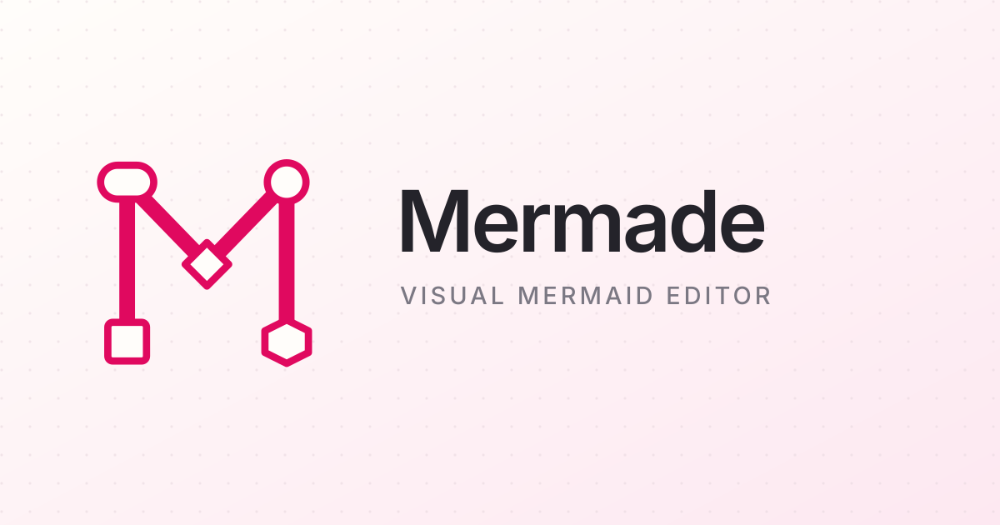
</p>

<p align="center">
  <a href="https://angeladmerkel.github.io/Mermade/"><strong>Open the editor</strong></a>
  ·
  <a href="#local-development">Run locally</a>
  ·
  <a href="#roadmap">Roadmap</a>
</p>

<p align="center">
  <a href="https://github.com/AngelaDMerkel/Mermade/actions/workflows/pages.yml"></a>
  <a href="LICENSE"></a>
  
  
</p>

Mermade is a modern, browser-based visual editor for [Mermaid](https://github.com/mermaid-js/mermaid). It grew out of a practical need: I produce a large amount of documentation for my work, and alongside the rise of AI and RAG, wanted a tool that made Mermaid fast and approachable enough for colleagues to use as well. Mermade helps it get made (heh).

Mermade runs entirely locally, and project storage remains in the browser.

## Why Mermade?

Mermaid diagrams are portable, simple and have guaranteed longevity because they are plain text. Unfortunately, although their text format is readable, reviewable, diffable and widely supported, source-first editing can make spatial work unnecessarily difficult: a small change in layout, grouping, labelling or relationships often requires repeatedly editing text and checking the render.

Mermade exists to close that gap.

- **Make Mermaid visual without making it proprietary.** Every successful visual edit becomes valid Mermaid source that can leave the editor at any time.
- **Support different ways of thinking.** Use Mermaid's authoritative layout, arrange graph-like diagrams spatially, edit ordered statements structurally, or work with chart data directly.
- **Make common changes immediate.** Single-click to select, double-click to edit text, drag to reposition, marquee-select, connect nodes, and convert selections into subgraphs.
- **Encourage useful diagrams.** Flowchart shapes are organised by recommended purpose, and diagram-aware Help links syntax guidance to established standards and good practice.
- **Keep local work local.** There is no account, database, tracking requirement, or server-side document store. Browser storage is used for the working project and preferences.

## Editing model

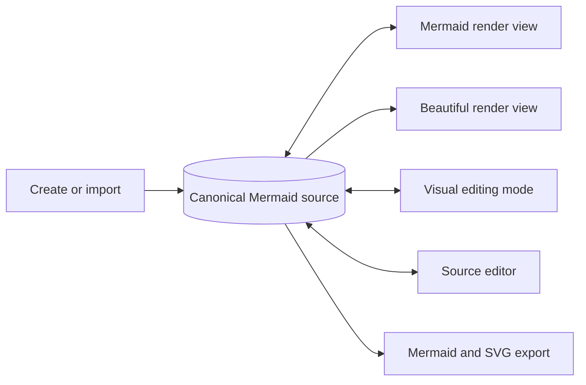

Candidate edits are parsed by the selected Mermaid engine before they are committed. That constraint lets visual tools remain helpful without silently creating a private diagram format or invalid Mermaid syntax.

## Features

### Visual and source editing

- Mermaid render view is the default and supports selection, marquee selection, panning, zooming, and fit-to-chart. Flowchart nodes edit directly; rendered labels in every other registered family map back to a complete Mermaid statement which is validated before it can replace the source.
- Beautiful view directly integrates Beautiful Mermaid for supported Flowchart, State, Sequence, Class, Entity Relationship, and XY diagrams. It adds an adaptive seven-role Mermade palette, all 15 bundled themes, transparent rendering, layout density controls, Mermaid-style priority, richer flowchart shapes, and interactive XY data tips without rewriting canonical source.
- FreeForm editing provides direct spatial control for graph and spatial diagram families, including exact Mermaid flowchart shapes.
- Structured editing presents ordered, lane-based, sequence, timeline, and grammar-oriented diagrams as editable statements.
- Data editing presents chart and dataset-oriented syntax as editable data statements.
- The source panel supports editing, undo/redo, version detection, validation, and copying without leaving the browser.
- Imports accept `.mmd`, `.mermaid`, `.md`, and `.txt`, including Mermaid code fences embedded in Markdown.

### Flowchart tools

- Add processes, decisions, relationships, and subgraphs from the canvas.
- Single-click selection and double-click text editing in Mermaid and FreeForm views.
- Shift-click multi-selection and a marquee tool that works in both views.
- Convert selected nodes into a Mermaid `subgraph`.
- Choose common shapes by recommended flowchart purpose, with the complete Mermaid shape catalogue still available.
- Organise pasted flowcharts from their graph relationships, or manually fit and organise the chart with `F` and `O`.
- Create a connected node from the current selection with `Shift` + `N`.

### Appearance, compatibility, and recovery

- Properties, Appearance, and diagram-level Style inspectors separate content, selection styling, and chart-wide configuration.
- Mermaid themes, rendering looks, compatible layout engines, fonts, and Base-theme palette variables are written as portable Mermaid frontmatter.
- Automatic Mermaid version detection chooses between bundled Mermaid 11.16 and Mermaid 10.9 compatibility; the engine can also be selected explicitly.
- Layered repair suggestions cover safe normalisation, version compatibility, and diagram-specific structural problems before any change is applied.
- Light, dark, and system themes, configurable grid and snapping, keyboard shortcut help, a welcome screen, and an optional guided tour are included.
- Export produces reusable Mermaid source, `.mmd` files, Mermaid SVG, Beautiful Mermaid SVG for compatible diagrams, or a Unicode text rendering.

## Feature gallery

Mermaid is designed to have a wide feature-set while retaining a familiar and approachable interface. This screenshot gallery highlights a few of the standout features. 

<table>
  <tr>
    <td width="50%" valign="top">
      <a href="public/screenshots/gallery/flowchart-properties.jpg">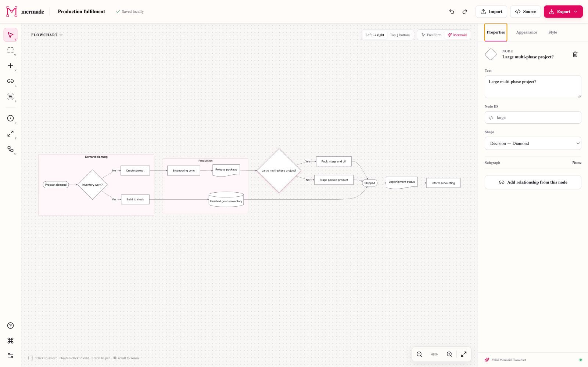</a><br>
      <strong>Mermaid view and Properties</strong><br>
      Work directly with Mermaid's authoritative render. Select a node to edit its identity, label, purpose-based shape, and relationships; double-click diagram text for immediate editing.
    </td>
    <td width="50%" valign="top">
      <a href="public/screenshots/gallery/freeform-appearance.jpg">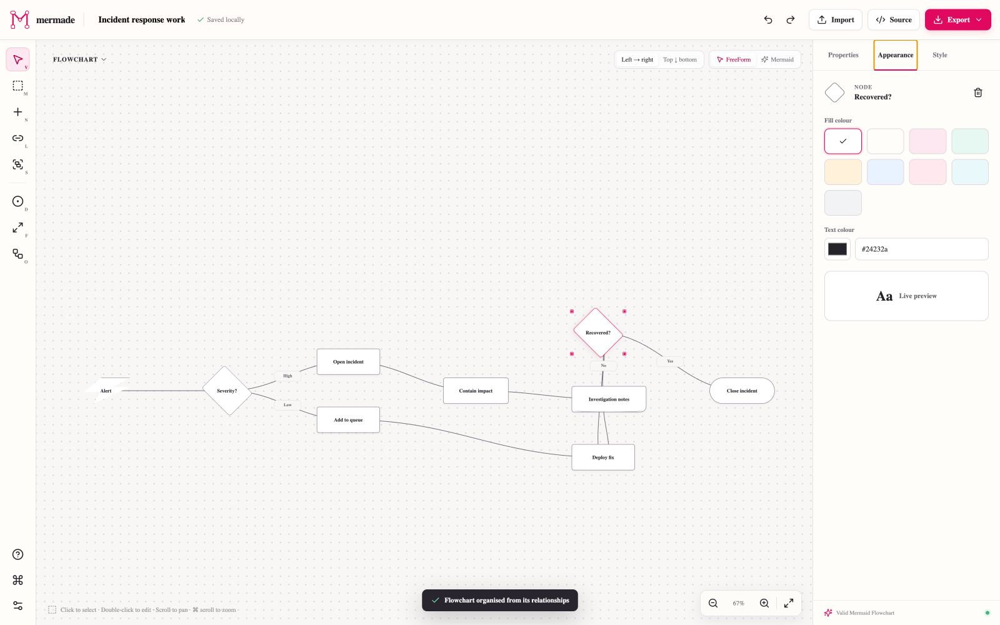</a><br>
      <strong>FreeForm and Appearance</strong><br>
      Reposition graph and spatial diagrams while retaining Mermaid-compatible node geometry. Apply fills and text colours to the active selection with a live preview.
    </td>
  </tr>
  <tr>
    <td width="50%" valign="top">
      <a href="public/screenshots/gallery/freeform-multiselect.jpg">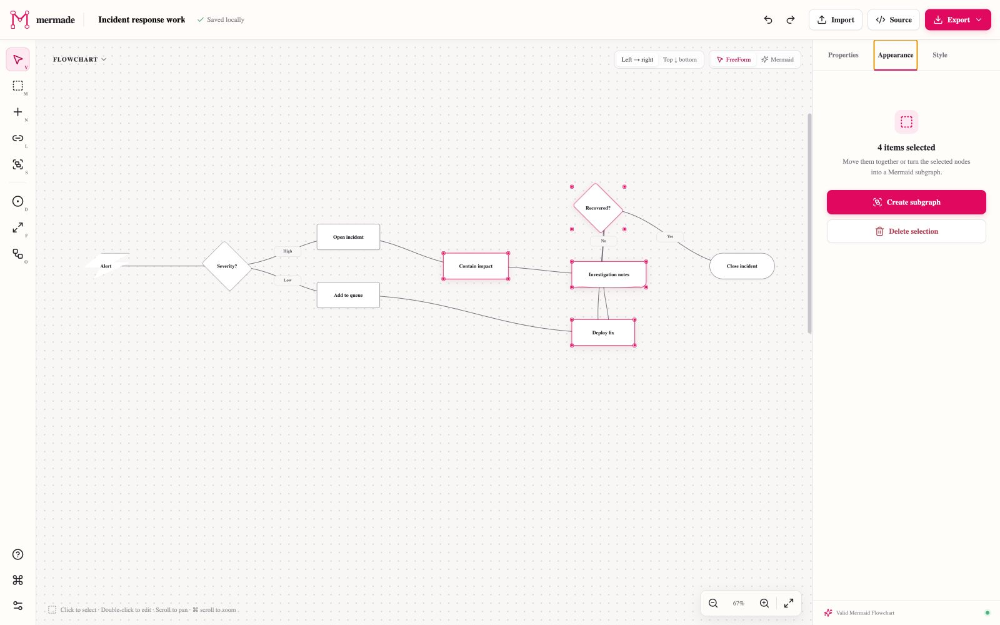</a><br>
      <strong>Multi-select and subgraphs</strong><br>
      Shift-click or marquee-select related nodes, move them together, and turn the selection into valid Mermaid <code>subgraph</code> syntax in one action.
    </td>
    <td width="50%" valign="top">
      <a href="public/screenshots/gallery/c4-style.jpg">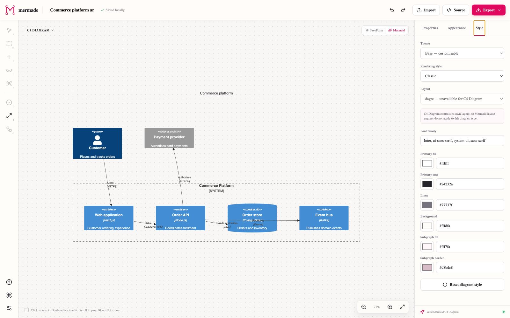</a><br>
      <strong>Diagram-level Style</strong><br>
      Configure themes, rendering looks, compatible layout engines, fonts, and Base-theme palette variables. Mermade writes the result as portable Mermaid frontmatter.
    </td>
  </tr>
  <tr>
    <td width="50%" valign="top">
      <a href="public/screenshots/gallery/sequence-structured.jpg">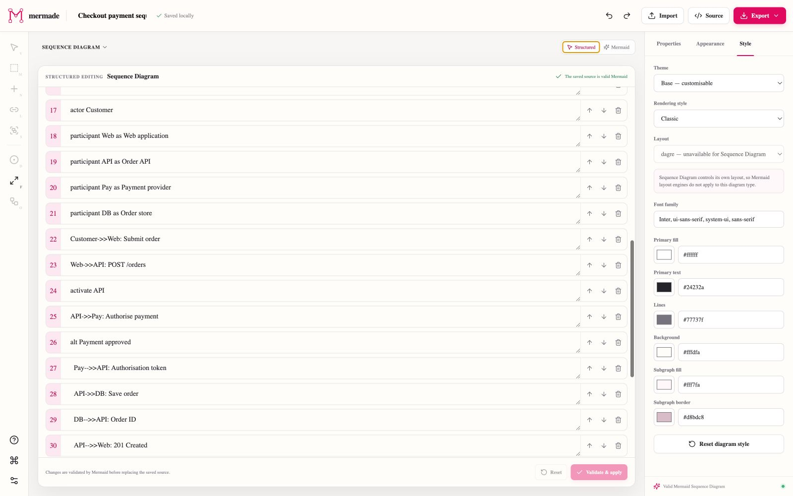</a><br>
      <strong>Structured editing</strong><br>
      Sequence and other ordered diagram families become editable, reorderable statements without hiding the underlying Mermaid grammar.
    </td>
    <td width="50%" valign="top">
      <a href="public/screenshots/gallery/xy-data.jpg">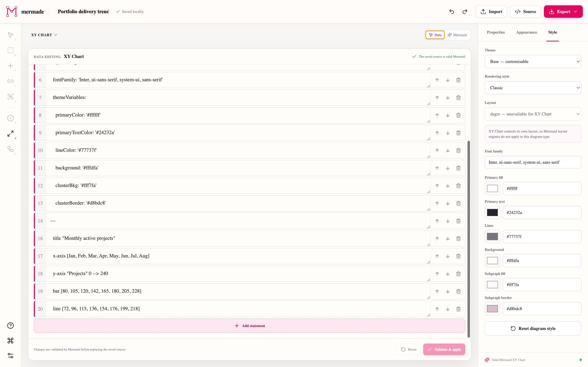</a><br>
      <strong>Data editing</strong><br>
      Quantitative diagram families expose their titles, axes, series, and datasets in a focused visual mode, with every change validated before it replaces the source.
    </td>
  </tr>
  <tr>
    <td width="50%" valign="top">
      <a href="public/screenshots/gallery/source-editor.jpg">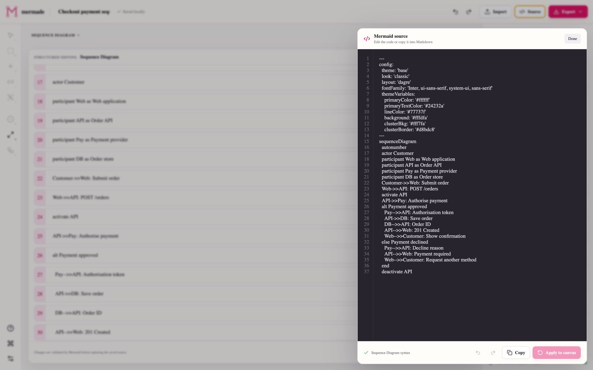</a><br>
      <strong>First-class source editing</strong><br>
      Edit, validate, copy, undo, and redo the canonical Mermaid document. Mermade detects the diagram family and minimum Mermaid version from pasted source.
    </td>
    <td width="50%" valign="top">
      <a href="public/screenshots/gallery/repair-workflow.jpg">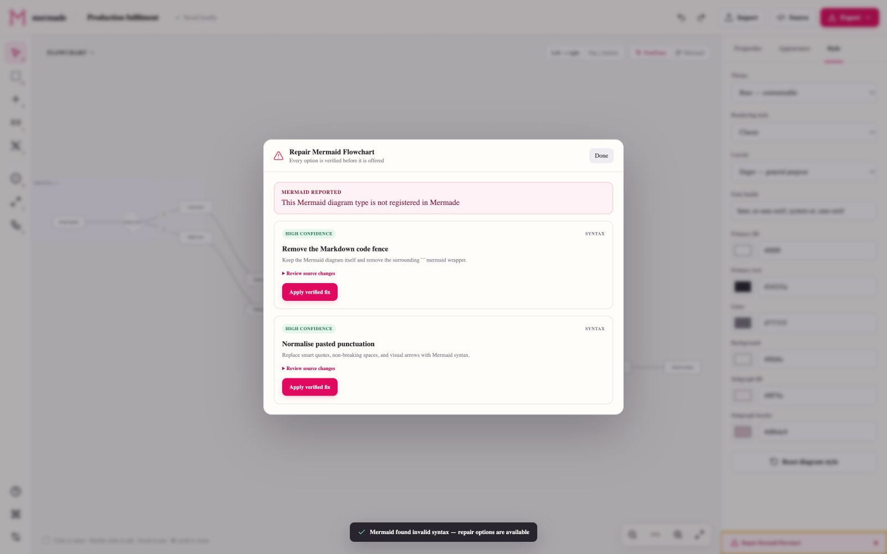</a><br>
      <strong>Verified, layered repair</strong><br>
      Invalid source becomes an actionable repair entry point. Safe normalisation, compatibility, and structural suggestions are tested before Mermade offers to apply them.
    </td>
  </tr>
  <tr>
    <td width="50%" valign="top">
      <a href="public/screenshots/gallery/flowchart-help.jpg">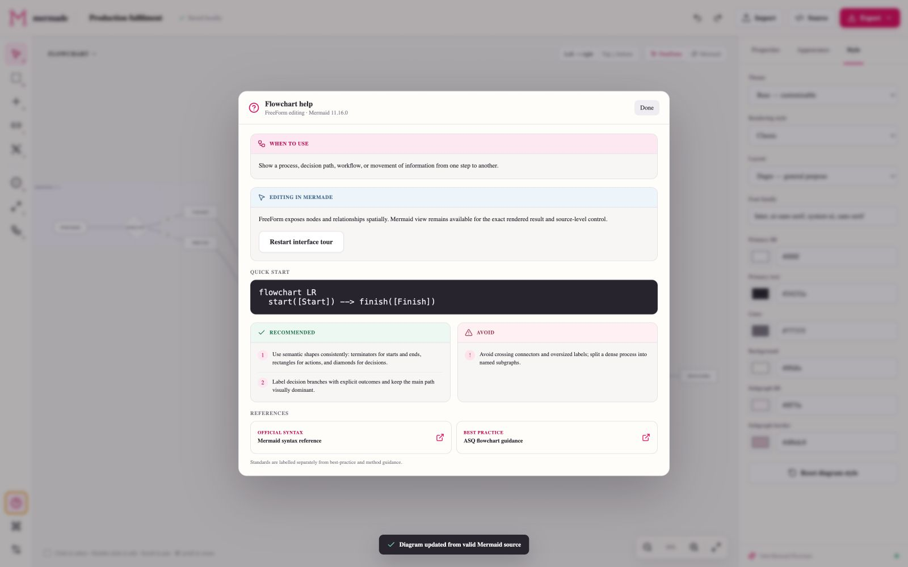</a><br>
      <strong>Diagram-aware Help</strong><br>
      The active diagram type supplies a quick start, recommended practices, common pitfalls, official syntax documentation, and relevant method or standards references.
    </td>
    <td width="50%" valign="top">
      <a href="public/screenshots/gallery/diagram-catalogue.jpg">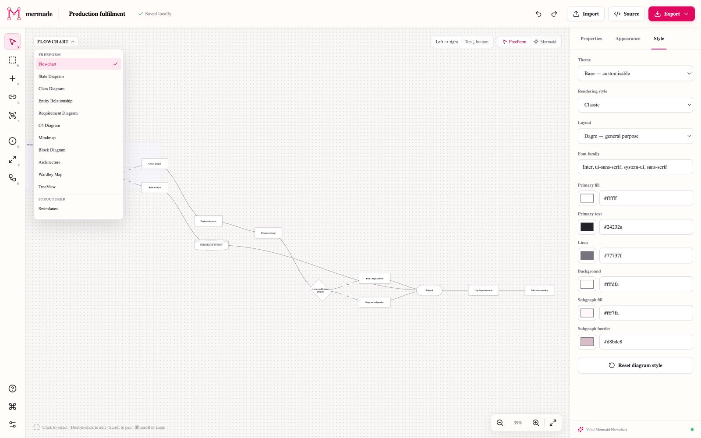</a><br>
      <strong>34 diagram types, three visual modes</strong><br>
      Switch diagram families from the canvas. FreeForm, Structured, and Data controls adapt to the active grammar while Mermaid rendering and source editing remain available throughout.
    </td>
  </tr>
</table>

## Diagram support

Mermade's registry currently covers 34 Mermaid diagram types. Exact Mermaid source editing and validated rendering are available for every registered type; visual controls are adapted to the diagram family.

| Visual mode | Best suited to | Registered diagram types |
| --- | --- | --- |
| **FreeForm** | Graphs and spatial models | Flowchart, State, Class, Entity Relationship, Requirement, C4, Mindmap, Block, Architecture, Wardley Map, TreeView |
| **Structured** | Ordered interactions, lanes, plans, and grammars | Swimlanes, Sequence, User Journey, Gantt, Git Graph, Timeline, ZenUML, Packet, Kanban, Event Modelling, Railroad, Railroad EBNF, Railroad ABNF, Railroad PEG |
| **Data** | Quantitative and set-based diagrams | Pie, Quadrant, Sankey, XY, Radar, Treemap, Venn, Ishikawa, Cynefin |

The deepest direct node, relationship, shape, and subgraph editing is currently available for flowcharts. Other diagram types use family-specific statement editors and always retain the full source editor as the compatibility baseline.

## Keyboard shortcuts

| Shortcut | Action | Shortcut | Action |
| --- | --- | --- | --- |
| `V` | Select | `M` | Marquee select |
| `N` | New node | `Shift` + `N` | New connected node |
| `L` | Link nodes | `S` | Create subgraph |
| `D` | Add decision | `F` | Fit chart |
| `Shift` + `F` | Fill chart to canvas width | `O` | Organise chart |
| `Delete` | Delete selection | `Cmd/Ctrl` + `Z` | Undo |
| `Cmd/Ctrl` + `Shift` + `Z` | Redo | Scroll | Pan in two dimensions |
| `Cmd/Ctrl` + scroll | Zoom |  |  |

## Local development

Mermade requires Node.js 22.13 or newer.

```bash
git clone https://github.com/AngelaDMerkel/Mermade.git
cd Mermade
npm install --ignore-scripts
npm run dev
```

Open [http://localhost:3000](http://localhost:3000). The editor, documents, preferences, tests, and screenshots are all local to the repository or browser.

Useful commands:

```bash
npm run dev          # local development server
npm test             # production build plus all automated tests
npm run lint         # static analysis
npm run build:pages  # verify the static GitHub Pages export
```

## Testing

Mermade tests both Mermaid correctness and rendered output. The shared diagram registry drives the standards suites, so registering a new diagram type automatically subjects it to the same baseline checks.

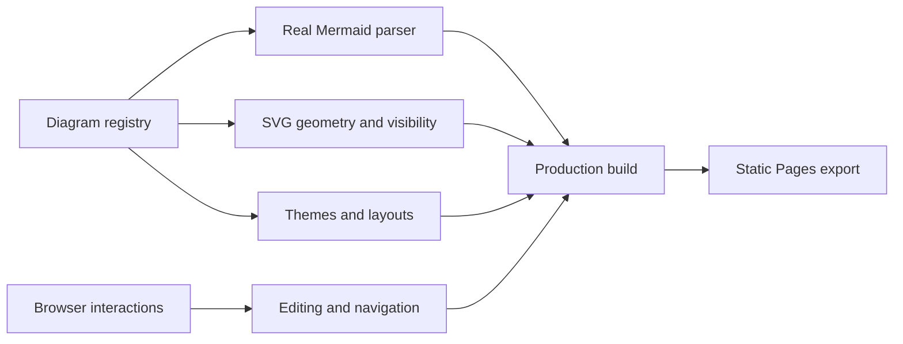

The test suite covers:

- **Syntax standards:** every starter passes the real browser parser for its Mermaid version.
- **Rendering standards:** every starter produces a non-empty, error-free SVG with finite geometry, visible text and shapes, and non-distorting scaling.
- **Diagram-specific regressions:** known rendering risks, including C4 title placement, receive explicit checks.
- **Style portability:** registered diagrams continue to parse and render with Mermade's Mermaid frontmatter, supported themes, rendering looks, and applicable layout engines.
- **Interaction behaviour:** onboarding, the guided tour, source repair, source undo/redo, direct Mermaid node and statement editing, FreeForm shapes, marquee selection, and view-position preservation are browser-tested.
- **Canvas compatibility:** all registered diagram types are exercised in Mermaid mode and their intended FreeForm, Structured, or Data editor; the six Beautiful Mermaid families are additionally exercised in Beautiful mode.
- **Static delivery:** generated HTML, metadata, branding, licence declarations, and the GitHub Pages workflow have regression coverage.

Rendering tests use Playwright Core with an installed Google Chrome. Set `CHROME_PATH` if Chrome is installed in a nonstandard location.

## Deployment

Mermade has no server-side data dependency. The included workflow tests the project, creates a static export, and deploys it whenever `main` is pushed.

Before the first deployment, open **Settings → Pages** in the GitHub repository and select **GitHub Actions** as the source. Then verify the same production target locally with:

GitHub Pages is available for public repositories on GitHub Free. Publishing directly from a private repository requires GitHub Pro, Team, or Enterprise; if GitHub shows an upgrade prompt, making the repository public or changing the account plan is an external prerequisite that the workflow cannot override.

```bash
npm run build:pages
```

The generated `out/` directory can also be served from any static web server. A future Docker image can serve the same build with nginx before any optional collaboration API is introduced.

## Credits, citations, and provenance

Mermade stands on a mature ecosystem and deliberately distinguishes dependencies, references, and original project code.

### Software

- Diagram parsing and SVG rendering are powered by [Mermaid](https://github.com/mermaid-js/mermaid), installed as an npm dependency under Mermaid's own licence.
- The optional Beautiful canvas and SVG/Unicode exports use [Beautiful Mermaid](https://github.com/lukilabs/beautiful-mermaid), installed under its MIT licence. Its interface icon is an original 24-pixel, Mermaid-pink interpretation of the four-part badge used by Beautiful Mermaid's live editor; no upstream brand asset or path data is bundled. Mermade uses its published specialist renderers, enriched theme roles, ELK spacing options, shape vocabulary, and XY interaction support through a source-preserving adapter. Beautiful Mermaid remains an alternative renderer; official Mermaid continues to validate canonical project source.
- ELK and Tidy Tree layouts use Mermaid's official [`@mermaid-js/layout-elk`](https://www.npmjs.com/package/@mermaid-js/layout-elk) and [`@mermaid-js/layout-tidy-tree`](https://www.npmjs.com/package/@mermaid-js/layout-tidy-tree) packages.
- ZenUML support uses Mermaid's official [`@mermaid-js/mermaid-zenuml`](https://github.com/mermaid-js/mermaid/tree/develop/packages/mermaid-zenuml) plugin.
- Interface icons are provided by [Lucide](https://github.com/lucide-icons/lucide). The application is built with [React](https://react.dev/) and [Next.js](https://nextjs.org/).

Mermade's interface, canvas, interaction model, source adapters, repair workflow, and test suites were implemented specifically for this project. No application code was copied or adapted from [saketkattu/mermaid-visual-editor](https://github.com/saketkattu/mermaid-visual-editor) or Mermaid's editor examples. Beautiful Mermaid is integrated through its published API as the rendering dependency credited above; its source was studied to use the API faithfully but was not copied into Mermade.

The build applies a narrow compatibility patch to Mermaid's generated Block Diagram renderer. The patch excludes a temporary D3 DOM handle from debug serialisation when Mermaid runs inside a React-owned document; it changes no parser or diagram semantics.

### Diagram guidance

The diagram-aware Help panel begins with the official [Mermaid syntax documentation](https://mermaid.js.org/intro/) and supplements it with method or standards references appropriate to the active chart. Key references include:

- [ASQ flowchart guidance](https://asq.org/quality-resources/flowchart) and [ASQ fishbone guidance](https://asq.org/quality-resources/fishbone)
- [OMG UML 2.5.1](https://www.omg.org/spec/UML/2.5.1) and [OMG SysML guidance](https://www.omg.org/sysml/sysmlv1/)
- [The C4 model](https://c4model.com/diagrams) and its [diagram review checklist](https://c4model.com/diagrams/checklist)
- [W3C EBNF notation](https://www.w3.org/TR/xml/#sec-notation), [RFC 5234 ABNF](https://www.rfc-editor.org/rfc/rfc5234.html), and [RFC 8200](https://www.rfc-editor.org/rfc/rfc8200.html)
- [The Kanban Guide](https://kanbanguides.org/), [Event Modelling](https://eventmodeling.org/posts/what-is-event-modeling/), and [Learn Wardley Mapping](https://learnwardleymapping.com/)

These links are educational references, not copied content or endorsements.

## Brand assets

The Connected M identity is stored in [`public/brand`](public/brand) as editable SVG masters and PNG exports. The primary accent is Mermaid pink (`#E0095F`). The package includes the 1200 × 630 title card, logo marks and lockups, favicon sizes, an Apple touch icon, and a 512-pixel application icon.

## Licence

Copyright © 2026 Colin Alexander Duffy.

Mermade's original source code and project files are available under the [PolyForm Noncommercial License 1.0.0](LICENSE). The licence is written specifically for software and permits use, modification, and redistribution for noncommercial purposes while requiring downstream recipients to receive the licence terms and required copyright notice.

This is a **source-available noncommercial licence**, not an OSI-approved open-source licence. Commercial use requires separate permission from the copyright holder. Third-party packages and externally sourced material are excluded from this grant and remain subject to their own licences.

## Roadmap

- [x] Browser-local projects with static GitHub Pages deployment
- [x] Mermaid and FreeForm views with position-preserving switching
- [x] Deep Beautiful Mermaid canvas with adaptive and bundled themes, source-style isolation, specialist renderers, interactive XY charts, SVG export, and Unicode export
- [x] Source editing, import, export, undo/redo, and layered repair
- [x] Flowchart node, relationship, shape, multi-select, marquee, and subgraph tools
- [x] Diagram-wide themes, rendering styles, layouts, and palette controls
- [x] Registry-driven syntax and rendering standards for all supported diagram types
- [x] Welcome experience, guided tour, diagram-aware Help, and keyboard shortcuts
- [ ] Deepen diagram-specific visual forms for Sequence, Gantt, State, Class, and ER diagrams
- [ ] Add alignment guides, editable edge routing, and node ports to FreeForm
- [ ] Add reusable named style presets and visual `classDef` editing
- [ ] Package the static editor as a small Docker/nginx image
- [ ] Explore optional shared projects and real-time collaboration behind a self-hosted service

---

<p align="center"><strong>Mermade</strong> — make Mermaid diagrams visually, keep them Mermaid.</p>
